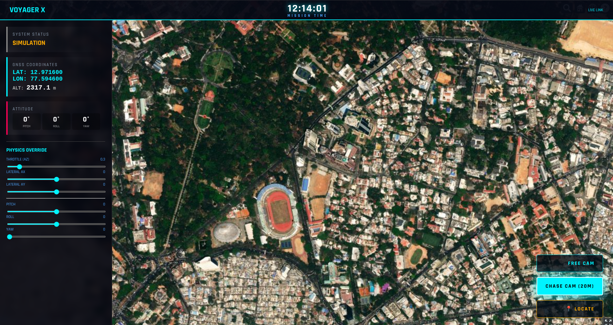
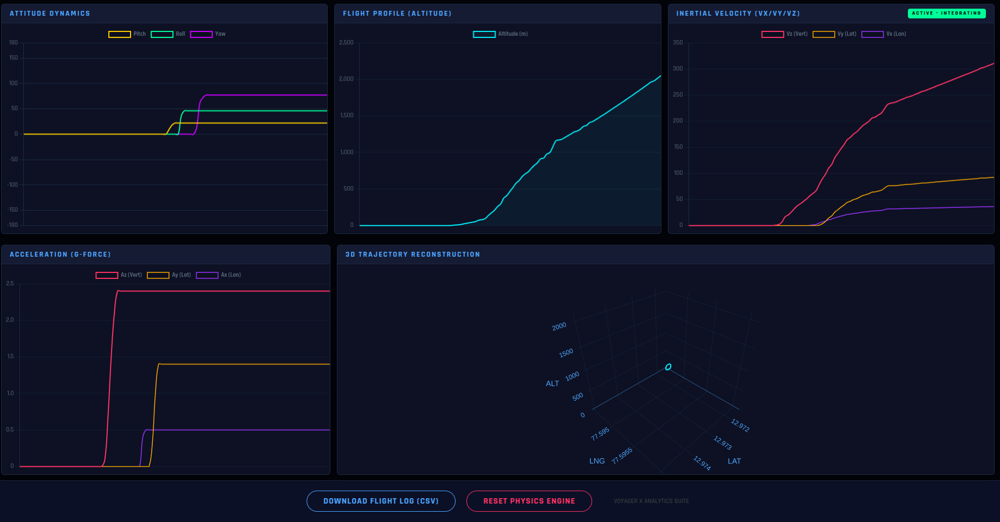

# VOYAGER X: UAV Telemetry & Digital Twin System

**VoyagerX** is a professional-grade avionics and ground-control ecosystem designed to eliminate the "Black Box" dilemma in experimental model rocketry. By leveraging high-throughput 2.4GHz telemetry and WebGL-based geospatial rendering, VoyagerX creates a live **Digital Twin** of a vehicle in flight, providing instantaneous situational awareness and deterministic data archival.

---

## System Overview

The architecture is bifurcated into a high-performance embedded flight computer and a modern, distributed ground station software suite. Unlike traditional LoRa-based systems that prioritize range over granularity, VoyagerX utilizes the **NRF24L01+ PA/LNA** protocol to achieve update rates of **20–50 Hz**, capturing transient aerodynamic events like transonic buffeting and deployment shocks.

**Key design goals:**

* Real-time Digital Twin visualization (3D orientation + geospatial trajectory)
* Deterministic packet logging (save-before-process)
* High-frequency telemetry for transient event capture
* Local-first architecture with offline post-flight analysis



---

## Avionics (Hardware)

**MCU**
ESP32 Dev Kit V1 — Dual-Core Xtensa® LX6 @ 240 MHz.

**Sensors**

* 9-Axis: MPU9250 (IMU)
* Pressure / Altimeter: BMP280
* GNSS: Ublox NEO-M8N

**Radio**
NRF24L01+ PA/LNA (2.4 GHz ISM)

**Power / Decoupling**
NRF24L01+ powered at 3.3V with integrated 100 µF decoupling capacitor for EMI stability.

**Firmware architecture**

* OS: FreeRTOS
* Core 0: Asynchronous GPS parsing (UART)
* Core 1: Deterministic Madgwick sensor-fusion loop (IMU) and telemetry packet assembly

---

## Mission Control (Software)

* **Backend:** Python Flask server — manages concurrent serial I/O and binary→JSON packet translation.
* **Visualizer:** CesiumJS — renders real-time orientation (quaternions) and geospatial trajectory.
* **Analytics:** Chart.js — real-time g-force, altitude, velocity plots.
* **Post-Flight:** Automated CSV logging and B-spline smoothed trajectory reconstruction via Plotly.

---

## Key Features

| Feature                  | Description                                                                                        |
| ------------------------ | -------------------------------------------------------------------------------------------------- |
| **Digital Twin**         | Photorealistic 3D visualization mirroring the rocket's exact Pitch, Roll, and Yaw in real time.    |
| **High-Speed Link**      | 20–50 Hz update rate using 2.4 GHz ISM band (NRF24L01+), ~10× faster than standard LoRa telemetry. |
| **Dual-Core Processing** | ESP32 multithreading: GNSS on Core 0, flight dynamics on Core 1.                                   |
| **Physics Engine**       | Client-side integration of acceleration data (`A_z`) to calculate velocity vectors (`V_z`) live.   |
| **Data Redundancy**      | "Live-Stream to Log" architecture ensures every packet is saved to CSV before processing.          |
| **Simulation Mode**      | Built-in 6-DOF physics simulator to test UI and tracking logic without hardware.                   |

---

## Repository Structure

```
VoyagerX/
├── app.py                 # Main Flask Server (Backend Logic & Threading)
├── firmware/              # Embedded C++ Code
│   ├── FlightComputer/    # Code for the Rocket Avionics (TX)
│   └── GroundStation/     # Code for the Receiver Unit (RX)
├── static/                # Static Assets
│   └── Rocket.glb         # 3D Model File (Required for visualization)
├── templates/             # HTML/JS Frontends
│   ├── landing.html       # Mission Start Menu
│   ├── visualizer.html    # 3D Tracking Dashboard (CesiumJS)
│   └── analytics.html     # Data Analysis Dashboard (Chart.js)
├── trajectory_analyzer.py # Offline Post-Flight Analysis Tool
└── requirements.txt       # Python Dependencies
```

---

## Hardware Manifest

### Flight Computer (TX)

| Component        | Function                        | Interface    |
| ---------------- | ------------------------------- | ------------ |
| ESP32 Dev Kit V1 | Main processor                  | —            |
| MPU9250          | 9-Axis IMU (Gyro / Accel / Mag) | I²C (`0x68`) |
| BMP280           | Precision altimeter             | I²C (`0x76`) |
| Ublox Neo-M8N    | High-precision GNSS             | UART2        |
| NRF24L01+ PA/LNA | Telemetry transceiver           | SPI (VSPI)   |
| LM2596           | Buck converter (7.4V → 5V)      | Power        |

### Ground Station (RX)

* MCU: ESP32 Dev Kit V1
* Radio: NRF24L01+ PA/LNA
* Connection: Micro-USB data cable to laptop (serial)

---

## Pin Connection Guide

> **WARNING:** The NRF24L01+ must be powered by **3.3V**. Applying 5V to VCC will destroy the module. Use proper level shifting for any 5V signals. Add a 100 µF decoupling capacitor across VCC/GND at the module socket.

### Flight Computer Wiring

| Component | Pin Name |     ESP32 Pin | Note                    |
| --------- | -------- | ------------: | ----------------------- |
| MPU9250   | SDA      |       GPIO 21 | I²C bus (shared)        |
| MPU9250   | SCL      |       GPIO 22 | I²C bus (shared)        |
| BMP280    | SDA      |       GPIO 21 | Shared I²C bus          |
| BMP280    | SCL      |       GPIO 22 | Shared I²C bus          |
| Neo-M8N   | TX       | GPIO 16 (RX2) | Hardware Serial (UART2) |
| Neo-M8N   | RX       | GPIO 17 (TX2) | Hardware Serial (UART2) |
| NRF24L01  | CE       |        GPIO 4 | Chip enable             |
| NRF24L01  | CSN      |        GPIO 5 | Chip select             |
| NRF24L01  | SCK      |       GPIO 18 | SPI clock (VSPI SCLK)   |
| NRF24L01  | MOSI     |       GPIO 23 | SPI MOSI (VSPI MOSI)    |
| NRF24L01  | MISO     |       GPIO 19 | SPI MISO (VSPI MISO)    |

---

## Installation & Deployment

### 1. Clone repository

```bash
git clone https://github.com/Voyager-Space/VoyagerX.git
cd VoyagerX
```

### 2. Setup Python environment

Use a virtual environment to isolate dependencies.

**Linux / macOS**

```bash
python3 -m venv venv
source venv/bin/activate
pip install -r requirements.txt
```

**Windows (PowerShell)**

```powershell
python -m venv venv
.\venv\Scripts\Activate.ps1
pip install -r requirements.txt
```

### 3. Flash firmware

Open `firmware/FlightComputer/VoyagerX_FC_Pro.ino` in Arduino IDE.

**Install required libraries** (Library Manager):

* `RF24` by TMRh20
* `BMP280_DEV` by Martin Lindupp
* `MPU9250_WE` by Wolfgang Ewald
* `TinyGPSPlus` by Mikal Hart

**Board selection:** DOIT ESP32 DEVKIT V1 — select correct COM port and upload.

Repeat for `firmware/GroundStation/VoyagerX_GS_Pro.ino` on the Receiver ESP32.

---

## Operational Guide

### Phase 1 — Pre-Launch

1. **Power On:** Connect the LiPo battery to the Flight Computer.
2. **Calibration:** Keep the rocket absolutely still and upright for **5 seconds** for gyroscope calibration and sensor zeroing.
3. **Link:** Plug the Ground Station into the laptop via USB.

### Phase 2 — Mission Control

Start the backend server:

```bash
python app.py
```

> Note: Edit `app.py` to match your serial port (e.g., `/dev/ttyUSB0` or `COM3`).

Open the UI in a browser:

```
http://localhost:5000
```

**Select Mode:**

* `CONNECT LIVE` — actual mission with hardware.
* `START SIMULATION` — use internal 6-DOF simulator for UI/logic test.




### Phase 3 — Post-Flight

Data is automatically saved to `voyager_log.csv`. To analyze the trajectory:

```bash
python trajectory_analyzer.py
```

This launches an interactive 3D plot showing flight path, apogee, and velocity profile; trajectory smoothing via B-splines is applied in the analyzer.

---

## Safety Protocols

* **Radio compliance:** System operates in the 2.4 GHz ISM band. Verify and follow local RF regulations and power limits.
* **LiPo handling:** Use a fire-safe charging bag, never short battery terminals, and store/dispose batteries safely.
* **Arming sequence:** Always power avionics **before** arming any pyrotechnic recovery charges (e-matches). Follow a strict checklist for arming and disarming.
* **EMI precautions:** Keep telemetry antenna clear of noisy digital wiring; use decoupling caps and good grounding practices.

---
> *"Ad Astra Per Aspera"* — Through Hardships to the Stars.
---

## Appendix

### Recommended tools / libraries (development)

* Python: Flask, pyserial, numpy, scipy, plotly
* Frontend: CesiumJS, Chart.js, Plotly.js
* Embedded: Arduino ESP32 core, RF24, TinyGPSPlus, MPU9250_WE

### Common troubleshooting

* **NRF24L01 resets / dropouts:** check 3.3V regulator current capability and decoupling cap.
* **GPS no fix:** confirm antenna visibility to sky; check UART wiring (TX/RX crossed correctly).
* **I²C conflicts:** confirm device addresses (`0x68` MPU9250, `0x76` BMP280) and proper pull-ups on SDA/SCL if using long cables.

---

### License / Notes

This document is a technical overview and deployment guide for the VoyagerX project. Use at your own risk; verify local safety and regulatory compliance before flight testing.

---
